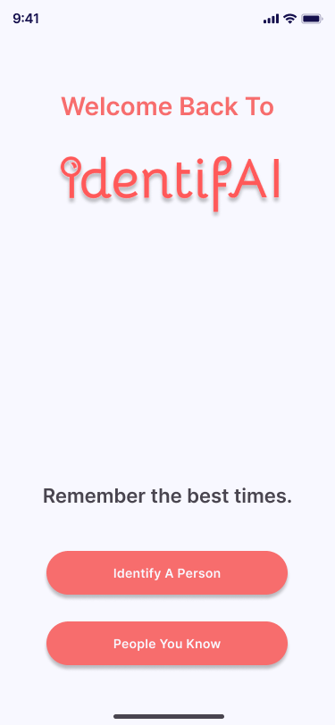

# hackGTX: IdentifAI


<br />
<div align="left">
  <a href="https://github.com/github_username/hackGTX">
    
  </a>

<h3 align="left">IdentifAI</h3>


<!-- TABLE OF CONTENTS -->
<details>
  <summary>Table of Contents</summary>
  <ol>
    <li>
      <a href="#about-the-project">About The Project</a>
      <ul>
        <li><a href="#built-with">Built With</a></li>
      </ul>
    </li>
    <li>
      <a href="#getting-started">Getting Started</a>
      <ul>
        <li><a href="#prerequisites">Prerequisites</a></li>
        <li><a href="#installation">Installation</a></li>
      </ul>
    </li>
    <li><a href="#usage">Usage</a></li>
    <li><a href="#roadmap">Roadmap</a></li>
    <li><a href="#contributing">Contributing</a></li>
    <li><a href="#license">License</a></li>
    <li><a href="#contact">Contact</a></li>
    <li><a href="#acknowledgments">Acknowledgments</a></li>
  </ol>
</details>


<!-- ABOUT THE PROJECT -->
## About The Project

  
  <a href = "https://www.youtube.com/watch?v=IKsSfN8OJ2o">Link to Video</a>


## Inspiration

Our inspiration for IdentifAI stemmed from a desire to make a meaningful impact on the lives of Alzheimer's patients and their families. We wanted to create a tool that would help patients recognize their loved ones and retain precious memories effortlessly.

## What it does
IdentifAI is an Android app that empowers Alzheimer's patients to identify their close ones swiftly. With just a click, users can capture a photo, and our app provides them with information about the person in the picture.

The initial setup involves users taking pictures of their loved ones and entering their names and brief descriptions. Once this step is complete, IdentifAI utilizes advanced AWS Rekognition AI to allow users to point their camera at someone. The app will then inform the user if it recognizes the person, providing their name and a short description. We ensure the security of this information by using Google Firebase for safe storage. We have also implemented biometric validation to protect data from unauthorized access, eliminating the need to remember a passcode.

## How we built it
Over the course of the hackathon, we undertook the challenge of learning Kotlin and Android Studio from scratch. We leveraged various technologies, including:

Kotlin
Android Studio
Firebase
Amazon Web Services (AWS)
Fingerprint API
Gallery Picker API
AWS Rekognition API
Challenges we ran into

Learning a new programming language and development environment in a short time frame was a significant challenge. We also faced complexities in integrating AWS Rekognition and Firebase to ensure smooth data processing and storage.

## Accomplishments that we're proud of
We are proud of creating IdentifAI in just one weekend, overcoming the steep learning curve of Kotlin and Android Studio. Our app has the potential to significantly improve the lives of Alzheimer's patients and their caregivers.

## What we learned
We learned how to develop an Android app using Kotlin, work with AWS services, and utilize biometric validation. Our experience in developing IdentifAI has given us valuable insights into mobile app development and cloud services.

What's next for IdentifAI

In the future, we aim to refine IdentifAI by expanding the usability of the app, ease of access, and implementing further features to help improve the lives of those who suffer from memory loss.


<p align="right">(<a href="#readme-top">back to top</a>)</p>


<!-- GETTING STARTED -->
## Getting Started

This is an example of how you may give instructions on setting up your project locally.
To get a local copy up and running follow these simple example steps.

### Prerequisites

This is an example of how to list things you need to use the software and how to install them.


### Installation

1. Make a clone of this repository
2. Clone the repo
   ```sh
   git clone https://github.com/Sprihanjay/hackGTX.git
   ```
3. Integrate the firebase in toolskit in Android Studio (optional to run in emulator)
   

<p align="right">(<a href="#readme-top">back to top</a>)</p>


<!-- ROADMAP -->
## Roadmap

- [x] User can take a snap of person and get the information 
- [x] User can add picture of their loved ones and with just one picture they are ready to use the app
- [x] AI + Firebase integration
  

<p align="right">(<a href="#readme-top">back to top</a>)</p>


<!-- LICENSE -->
## License

Distributed under the MIT License. See `LICENSE.txt` for more information.

<p align="right">(<a href="#readme-top">back to top</a>)</p>


<!-- ACKNOWLEDGMENTS -->
## Acknowledgments
* [John Atkinson](https://github.com/Green-atkinson) - Frontend, Figma Mockup
* [Luke Hartzell](https://github.com/LukeHartzell1) - Backend, Presentation, Integration to Frontend
* [Sprihanjay Banik](https://github.com/Sprihanjay) - Backend, Integration to Frontend
<p align="right">(<a href="#readme-top">back to top</a>)</p>


<!-- MARKDOWN LINKS & IMAGES -->
<!-- https://www.markdownguide.org/basic-syntax/#reference-style-links -->
[contributors-shield]: https://img.shields.io/github/contributors/github_username/repo_name.svg?style=for-the-badge
[contributors-url]: https://github.com/github_username/repo_name/graphs/contributors
[forks-shield]: https://img.shields.io/github/forks/github_username/repo_name.svg?style=for-the-badge
[forks-url]: https://github.com/github_username/repo_name/network/members
[stars-shield]: https://img.shields.io/github/stars/github_username/repo_name.svg?style=for-the-badge
[stars-url]: https://github.com/github_username/repo_name/stargazers
[issues-shield]: https://img.shields.io/github/issues/github_username/repo_name.svg?style=for-the-badge
[issues-url]: https://github.com/github_username/repo_name/issues
[license-shield]: https://img.shields.io/github/license/github_username/repo_name.svg?style=for-the-badge
[license-url]: https://github.com/github_username/repo_name/blob/master/LICENSE.txt
[linkedin-shield]: https://img.shields.io/badge/-LinkedIn-black.svg?style=for-the-badge&logo=linkedin&colorB=555
[linkedin-url]: https://linkedin.com/in/linkedin_username
[product-screenshot]: images/screenshot.png
[Next.js]: https://img.shields.io/badge/next.js-000000?style=for-the-badge&logo=nextdotjs&logoColor=white
[Next-url]: https://nextjs.org/
[React.js]: https://img.shields.io/badge/React-20232A?style=for-the-badge&logo=react&logoColor=61DAFB
[React-url]: https://reactjs.org/
[Vue.js]: https://img.shields.io/badge/Vue.js-35495E?style=for-the-badge&logo=vuedotjs&logoColor=4FC08D
[Vue-url]: https://vuejs.org/
[Angular.io]: https://img.shields.io/badge/Angular-DD0031?style=for-the-badge&logo=angular&logoColor=white
[Angular-url]: https://angular.io/
[Svelte.dev]: https://img.shields.io/badge/Svelte-4A4A55?style=for-the-badge&logo=svelte&logoColor=FF3E00
[Svelte-url]: https://svelte.dev/
[Laravel.com]: https://img.shields.io/badge/Laravel-FF2D20?style=for-the-badge&logo=laravel&logoColor=white
[Laravel-url]: https://laravel.com
[Bootstrap.com]: https://img.shields.io/badge/Bootstrap-563D7C?style=for-the-badge&logo=bootstrap&logoColor=white
[Bootstrap-url]: https://getbootstrap.com
[JQuery.com]: https://img.shields.io/badge/jQuery-0769AD?style=for-the-badge&logo=jquery&logoColor=white
[JQuery-url]: https://jquery.com 
